###################
Quickstart Tutorial
###################

This is a "quickstart" tutorial for NMRPy in which an Agilent (Varian) NMR dataset will be processed. The following topics are explored:

    * :ref:`quickstart_importing`
    * :ref:`quickstart_apodisation`
    * :ref:`quickstart_phasecorrection`
    * :ref:`quickstart_peakpicking`
    * :ref:`quickstart_deconvolution`
    * :ref:`quickstart_exporting`

This tutorial will use the test data in the nmrpy install directory: ::
    
    nmrpy/tests/test_data/test1.fid

The dataset consists of a time array of spectra of the phosphoglucose-isomerase reaction:

    *fructose-6-phosphate -> glucose-6-phosphate*

.. _quickstart_importing:

Importing
=========

The basic NMR project object used in NMRPy is the
:class:`~nmrpy.data_objects.FidArray`, which consists of a set of
:class:`~nmrpy.data_objects.Fid` objects, each representing a single spectrum in
an array of spectra. 

The simplest way to instantiate an :class:`~nmrpy.data_objects.FidArray` is by
using the :meth:`~nmrpy.data_objects.FidArray.from_path` method, and specifying
the path of the *.fid* directory: ::

    import nmrpy
    fid_array = nmrpy.data_objects.FidArray.from_path(fid_path='./tests/test_data/test1.fid')

You will notice that the *fid_array* object is instantiated and now owns
several attributes, amongst others, which are of the form *fidXX* where *XX* is
a number starting at 00. These are the individual arrayed
:class:`~nmrpy.data_objects.Fid` objects.

.. _quickstart_apodisation:

Apodisation and Fourier-transformation
======================================

To quickly visualise the imported data, we can use the plotting functions owned
by each :class:`~nmrpy.data_objects.Fid` instance. This will not display the
imaginary portion of the data: ::

    fid_array.fid00.plot_ppm()

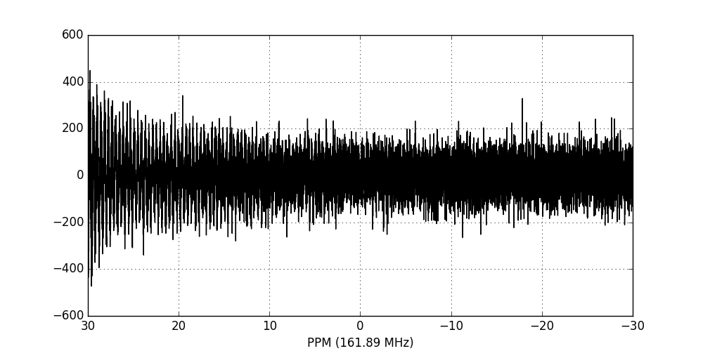

We now perform apodisation of the FIDs using the default value of 5 Hz, and visualise the result: ::

    fid_array.emhz_fids()
    fid_array.fid00.plot_ppm()

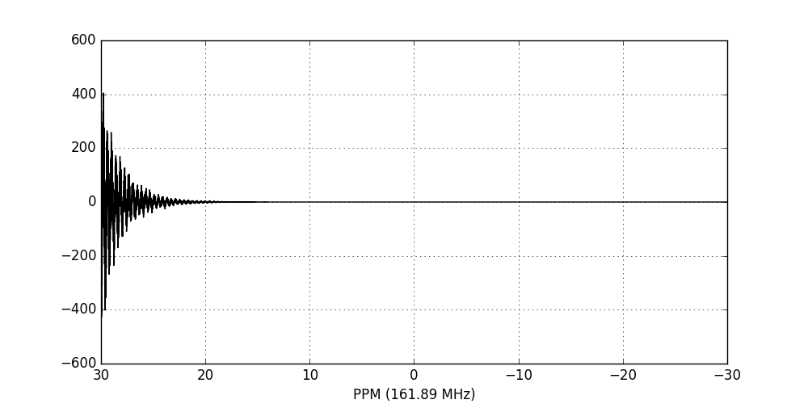

Finally, we Fourier-transform the data into the frequency domain: ::

    fid_array.ft_fids()
    fid_array.fid00.plot_ppm()

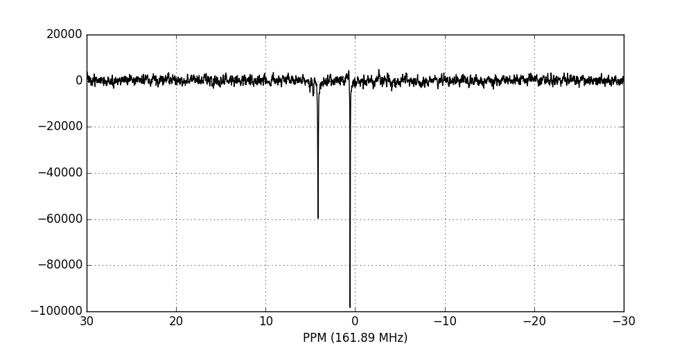

.. _quickstart_phasecorrection:

Phase-correction
================

It is clear from the data visualisation that at this stage the spectra require
phase-correction. NMRPy provides a number of GUI widgets for manual processing
of data. In this case we will use the :meth:`~nmrpy.data_objects.Fid.phaser`
method on *fid00*: ::

    fid_array.fid00.phaser()

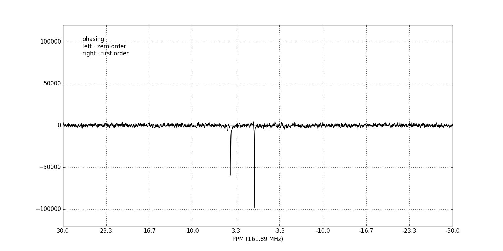

Dragging with the left mouse button and right mouse button will apply zero- and
first-order phase-correction respectively.

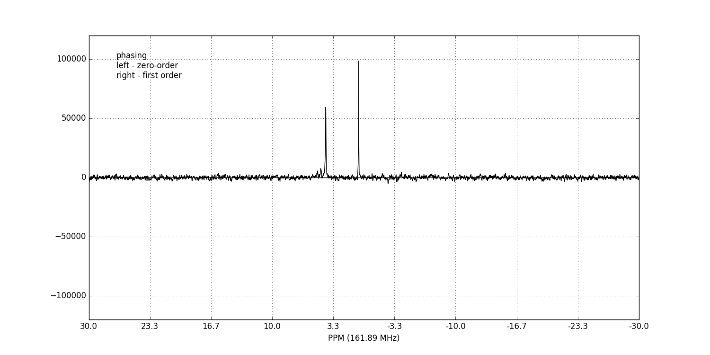

Alternatively, automatic phase-correction can be applied at either the
:class:`~nmrpy.data_objects.FidArray` or :class:`~nmrpy.data_objects.Fid`
level. We will apply it to the whole array: ::

    fid_array.phase_correct_fids()

And plot an array of the phase-corrected data: ::

    fid_array.plot_array()

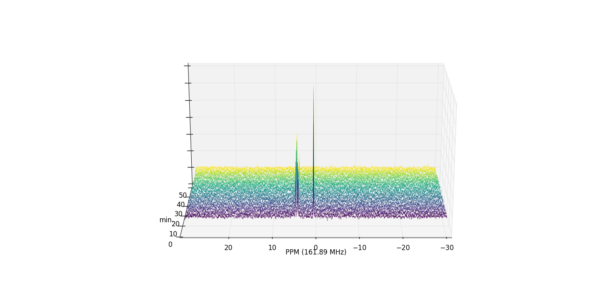

Zooming in on the relevant peaks, and filling the spectra produces a more interesting plot: ::

    fid_array.plot_array(upper_ppm=7, lower_ppm=-1, filled=True, azim=-76, elev=23)

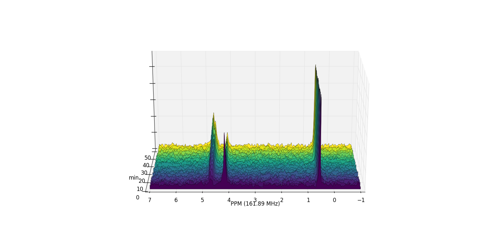

At this stage it is useful to discard the imaginary component of our data, and
possibly normalise the data (by the maximum data value amongst the
:class:`~nmrpy.data_objects.Fid` objects): ::

    fid_array.real_fids()
    fid_array.norm_fids()

.. _quickstart_peakpicking:

Peak-picking
============

To begin the process of integrating peaks by deconvolution, we will need to
pick some peaks. The :attr:`~nmrpy.data_objects.Fid.peaks` object is an array
of peak positions, and :attr:`~nmrpy.data_objects.Fid.ranges` is an array of
range boundaries. These two objects are used in deconvolution to integrate the
data by fitting Lorentzian/Gaussian peakshapes to the spectra.
:attr:`~nmrpy.data_objects.Fid.peaks` may be specified programatically, or
picked using the interactive GUI widget: ::

    fid_array.peakpicker(fid_number=10)

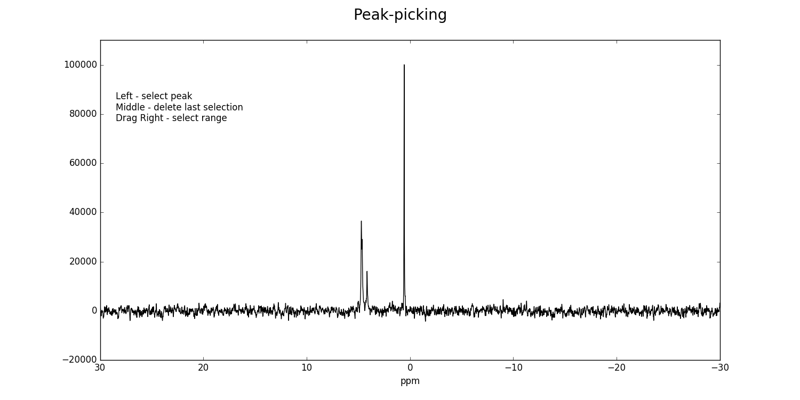

Left-clicking specifies a peak selection with a vertical red line. Dragging
with a right-click specifies a range to fit independently with a grey
rectangle:

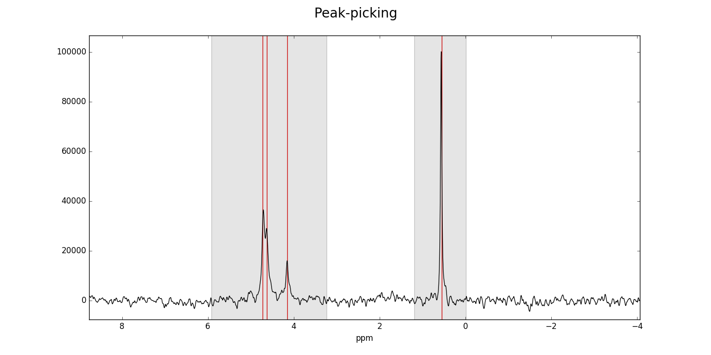

Ranges divide the data into smaller portions, which significantly speeds up the
process of fitting of peakshapes to the data. Range-specification also prevents
incorrect peaks from being fitted by the fitting algorithm.

Having used the :meth:`~nmrpy.data_objects.FidArray.peakpicker`
:class:`~nmrpy.data_objects.FidArray` method (as opposed to the
:meth:`~nmrpy.data_objects.Fid.peakpicker` on each individual
:class:`~nmrpy.data_objects.Fid` instance), the peak and range selections have
now been assigned to each :class:`~nmrpy.data_objects.Fid` in the array: ::

    print(fid_array.fid00.peaks)
    [ 4.73  4.63  4.15  0.55]
    print(fid_array.fid00.ranges)
    [[ 5.92  3.24]
     [ 1.19 -0.01]]

.. _quickstart_deconvolution:

Deconvolution
=============

Individual :class:`~nmrpy.data_objects.Fid` objects can be deconvoluted with
:meth:`~nmrpy.data_objects.Fid.deconv`. :class:`~nmrpy.data_objects.FidArray`
objects can be deconvoluted with
:meth:`~nmrpy.data_objects.FidArray.deconv_fids`. By default this is a
multiprocessed method (*mp=True*), which will fit pure Lorentzian lineshapes
(*frac_gauss=0.0*) to the :attr:`~nmrpy.data_objects.Fid.peaks` and
:attr:`~nmrpy.data_objects.Fid.ranges` specified in each
:class:`~nmrpy.data_objects.Fid`.

We shall fit the whole array at once: ::

    fid_array.deconv_fids()

And visualise the deconvoluted spectra: ::

    fid_array.fid10.plot_deconv()

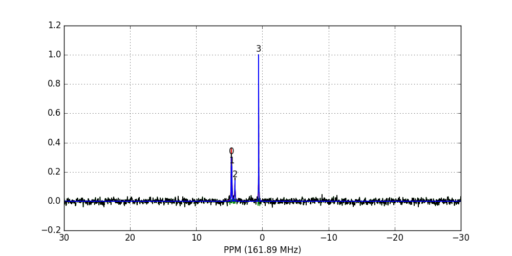

Zooming-in to a set of peaks makes clear the fitting result: ::

    fid_array.fid10.plot_deconv(upper_ppm=5.5, lower_ppm=3.5)
    fid_array.fid10.plot_deconv(upper_ppm=0.9, lower_ppm=0.2)

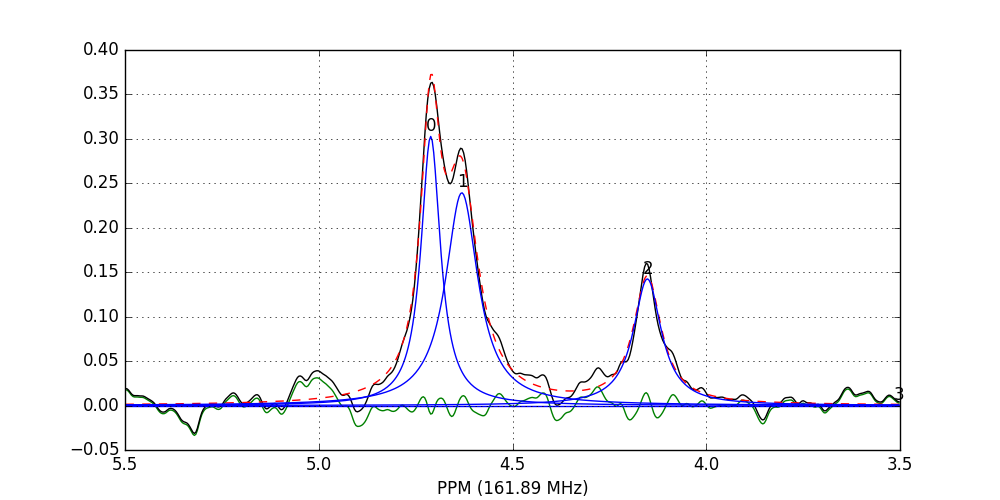

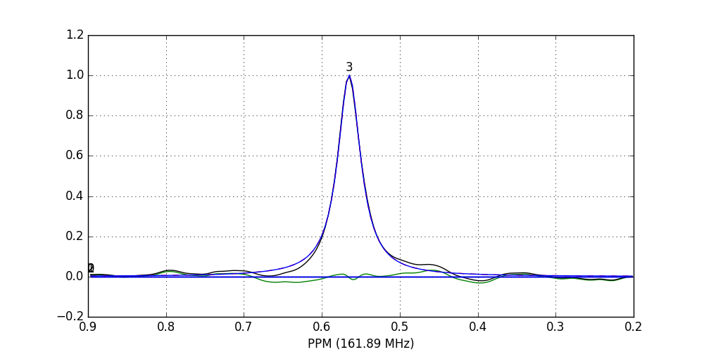

    Black: original data; blue: individual peak shapes (and peak numbers
    above); red: summed peak shapes; green: residual (original data - summed
    peakshapes) 

In this case, peaks 0 and 1 belong to glucose-6-phosphate, peak 2 belongs to
fructose-6-phosphate, and peak 3 belongs to triethyl-phosphate. 

Peak integrals of the array are stored in
:attr:`nmrpy.data_objects.FidArray.deconvoluted_integrals`, or in each
individual :class:`~nmrpy.data_objects.Fid` as
:attr:`nmrpy.data_objects.Fid.deconvoluted_integrals`.

We could easily plot the species integrals using the following code: ::

   import pylab

    integrals = fid_array.deconvoluted_integrals.transpose()
    
    g6p = integrals[0] + integrals[1]
    f6p = integrals[2]
    tep = integrals[3]

    #scale species by internal standard tep
    g6p = 5.0*g6p/tep.mean()
    f6p = 5.0*f6p/tep.mean()
    tep = 5.0*tep/tep.mean()
    
    species = {'g6p': g6p,
               'f6p': f6p,
               'tep': tep}
    
    fig = pylab.figure()
    ax = fig.add_subplot(111)
    for k, v in species.items():
        ax.plot(fid_array.t, v, label=k)

    ax.set_xlabel('min')
    ax.set_ylabel('mM')
    ax.legend(loc=0, frameon=False)

    pylab.show()

   
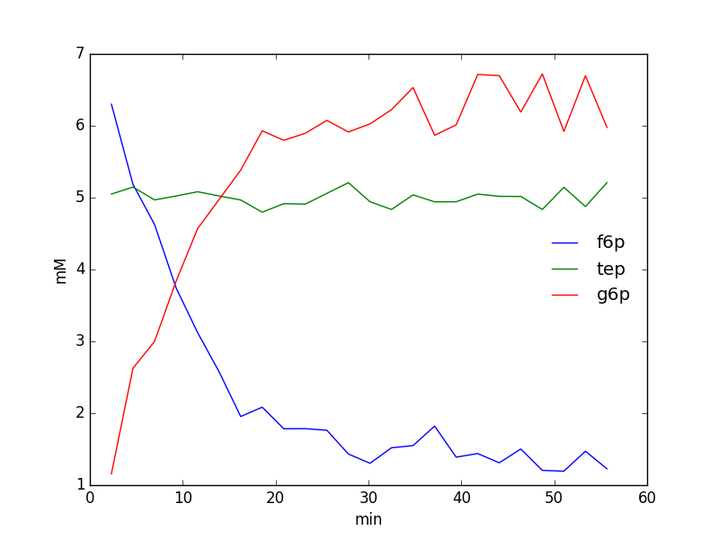

.. _quickstart_exporting:

Exporting/Importing
===================

The current state of any :class:`~nmrpy.data_objects.FidArray` object can be
saved to file using the :meth:`~nmrpy.data_objects.FidArray.save_to_file` method: ::

    fid_array.save_to_file(filename='fidarray.nmrpy')

And reloaded using :meth:`~nmrpy.data_objects.FidArray.from_path`: ::

    fid_array = nmrpy.data_objects.FidArray.from_path(fid_path='fidarray.nmrpy')
