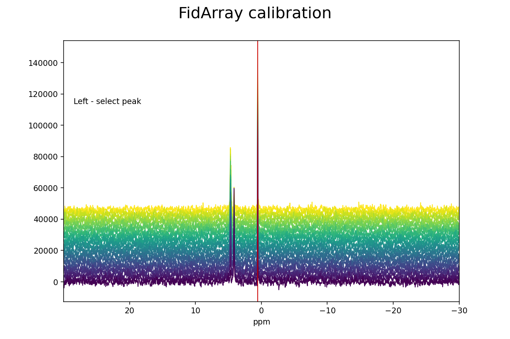

.. _quickstart:

###################
Quickstart Tutorial
###################

This is a "quickstart" tutorial for NMRPy in which an Agilent (Varian) NMR 
dataset will be processed. The following topics are explored:

    * :ref:`quickstart_importing`
    * :ref:`quickstart_apodisation`
    * :ref:`quickstart_phasecorrection`
    * :ref:`quickstart_calibration`
    * :ref:`quickstart_peakpicking`
    * :ref:`quickstart_deconvolution`
    * :ref:`quickstart_exporting`
    * :ref:`quickstart_script`

This tutorial will use the test data in the nmrpy install directory: ::
    
    nmrpy/tests/test_data/test1.fid

The dataset consists of a time array of spectra of the phosphoglucose isomerase 
reaction:

    *fructose-6-phosphate -> glucose-6-phosphate*
    
An example Jupyter notebook is provided in the ``docs`` subdirectory of
the nmrpy install directory, which mirrors this Quickstart Tutorial. ::

    nmrpy/docs/quickstart_tutorial.ipynb

.. _quickstart_importing:

Importing
=========

The basic NMR project object used in NMRPy is the
:class:`~nmrpy.data_objects.FidArray`, which consists of a set of
:class:`~nmrpy.data_objects.Fid` objects, each representing a single spectrum in
an array of spectra. 

The simplest way to instantiate an :class:`~nmrpy.data_objects.FidArray` is by
using the :meth:`~nmrpy.data_objects.FidArray.from_path` method, and specifying
the path of the *.fid* directory: ::

    >>> import nmrpy
    >>> fid_array = nmrpy.from_path(fid_path='./tests/test_data/test1.fid')

You will notice that the ``fid_array`` object is instantiated and now owns
several attributes, most of which are of the form ``fidXX`` where *XX* is
a number starting at 00. These are the individual arrayed
:class:`~nmrpy.data_objects.Fid` objects.

.. _quickstart_apodisation:

Apodisation and Fourier-transformation
======================================

To quickly visualise the imported data, we can use the plotting functions owned
by each :class:`~nmrpy.data_objects.Fid` instance. This will not display the
imaginary portion of the data: ::

    >>> fid_array.fid00.plot_ppm()

We now perform apodisation of the FIDs using the default value of 5 Hz, and 
visualise the result: ::

    >>> fid_array.emhz_fids()
    >>> fid_array.fid00.plot_ppm()

Finally, we Fourier-transform the data into the frequency domain: ::

    >>> fid_array.ft_fids()
    >>> fid_array.fid00.plot_ppm()

.. _quickstart_phasecorrection:

Phase-correction
================

It is clear from the data visualisation that at this stage the spectra require
phase-correction. NMRPy provides a number of GUI widgets for manual processing
of data. In this case we will use the :meth:`~nmrpy.data_objects.Fid.phaser`
method on ``fid00``: ::

    >>> fid_array.fid00.phaser()

Dragging with the left mouse button and right mouse button will apply zero- and
first-order phase-correction, respectively. The cumulative phase correction for 
the zero-order (``p0``) and first-order (``p1``) phase angles is displayed at 
the bottom of the plot so that these can be applied programatically to all 
:class:`~nmrpy.data_objects.Fid` objects in the 
:class:`~nmrpy.data_objects.FidArray` using the 
:meth:`~nmrpy.data_objects.FidArray.ps_fids` method.

Alternatively, automatic phase-correction can be applied at either the
:class:`~nmrpy.data_objects.FidArray` or :class:`~nmrpy.data_objects.Fid`
level. We will apply it to the whole array: ::

    >>> fid_array.phase_correct_fids()

And plot an array of the phase-corrected data: ::

    >>> fid_array.plot_array()

.. image:: _static/quickstart_6.png

Zooming in on the relevant peaks, changing the view perspective, and filling 
the spectra produces a more interesting plot: ::

    >>> fid_array.plot_array(upper_ppm=7, lower_ppm=-1, filled=True, azim=-76, elev=23)

.. image:: _static/quickstart_7.png

At this stage it is useful to discard the imaginary component of our data, and
possibly normalise the data (by the maximum data value amongst the
:class:`~nmrpy.data_objects.Fid` objects): ::

    >>> fid_array.real_fids()
    >>> fid_array.norm_fids()

.. _quickstart_calibration:

Calibration
===========

The spectra may need calibration by assigning a chemical shift to a 
reference peak of a known standard and adjusting the spectral offset 
accordingly. To this end, a 
:meth:`~nmrpy.data_objects.FidArray.calibrate` convenience method exists that 
allows the user to easily select a peak and specify the PPM. This method can be 
applied at either the :class:`~nmrpy.data_objects.FidArray` or 
:class:`~nmrpy.data_objects.Fid` level. We will apply it to the whole array: ::

    >>> fid_array.calibrate()

Left-clicking selects a peak and its current ppm value is displayed below 
the spectrum. The new ppm value can be entered in a text box, and hitting 
``Enter`` completes the calibration process. Here we have chosen triethyl 
phosphate (TEP) as reference peak and assigned its chemical shift value of 0.44 
ppm (the original value was 0.57 ppm, and the offset of all the spectra in the 
array has been adjusted by 0.13 ppm after the calibration).
    
.. _quickstart_peakpicking:

Peak-picking
============

To begin the process of integrating peaks by deconvolution, we will need to
pick some peaks. The :attr:`~nmrpy.data_objects.Fid.peaks` attribute of a 
:class:`~nmrpy.data_objects.Fid` is an array
of peak positions, and :attr:`~nmrpy.data_objects.Fid.ranges` is an array of
range boundaries. These two objects are used in deconvolution to integrate the
data by fitting Lorentzian/Gaussian peak shapes to the spectra.
:attr:`~nmrpy.data_objects.Fid.peaks` and :attr:`~nmrpy.data_objects.Fid.ranges`
may be specified programatically, or picked using the interactive GUI widget: ::

    >>> fid_array.peakpicker(fid_number=10)

Left-clicking specifies a peak selection with a vertical red line. Dragging
with a right-click specifies a range to fit independently with a grey
rectangle:

Inadvertent wrongly selected peaks can be deleted with Ctrl+left-click; wrongly 
selected ranges can be deleted with Ctrl+right-click. Once you are done 
selecting peaks and ranges, these need to be assigned to the 
:class:`~nmrpy.data_objects.FidArray`; this is achieved with a 
Ctrl+Alt+right-click.

Ranges divide the data into smaller portions, which significantly speeds up the
process of fitting of peakshapes to the data. Range-specification also prevents
incorrect peaks from being fitted by the fitting algorithm.

Having used the :meth:`~nmrpy.data_objects.FidArray.peakpicker`
:class:`~nmrpy.data_objects.FidArray` method (as opposed to the
:meth:`~nmrpy.data_objects.Fid.peakpicker` on each individual
:class:`~nmrpy.data_objects.Fid` instance), the peak and range selections have
now been assigned to each :class:`~nmrpy.data_objects.Fid` in the array: ::

    >>> print(fid_array.fid00.peaks)
    [ 4.73  4.63  4.15  0.55]
    >>> print(fid_array.fid00.ranges)
    [[ 5.92  3.24]
     [ 1.19 -0.01]]

Peak-picking trace selector
---------------------------

Sometimes peaks are subject to drift so that the chemical shift changes over 
time; this can happen, e.g., when the pH of the reaction mixture changes as the 
reaction proceeds. NMRPy offers a convenient trace selector, with which the 
drift of the peaks can be traced over time and the chemical shift selected 
accordingly as appropriate for the particular :class:`~nmrpy.data_objects.Fid`. 
::
    
    >>> fid_array.peakpicker_traces(voff=0.08)

As for the :meth:`~nmrpy.data_objects.FidArray.peakpicker`, ranges are selected 
by dragging the right mouse button and can be deleted with Ctrl+right-click. A 
peak trace is initiated by left-clicking below the peak underneath the first 
Fid in the series. This selects a point and anchors the trace line, which is 
displayed in red as the mouse is moved. The trace will attempt to follow 
the highest peak. Further trace points can be added by repeated left-clicking, 
thus tracing the peak through the individual Fids in the series. It is not 
necessary to add an anchor point for every Fid, only when the trace needs to 
change direction. Once the trace has traversed all the Fids, select a final 
trace point (left-click) and then finalize the trace with a right-click. The trace will 
change colour from red to blue to indicate that it has been finalized.

Additional peaks can then be selected by initiating a new trace. Wrongly 
selected traces can be deleted by Ctrl+left-click at the bottom of the trace 
that should be removed. Note that the interactive buttons on the matplotlib 
toolbar for the figure can be used to zoom and pan into a region of interest of 
the spectra.

As previously, peaks and ranges need to be assigned to the 
:class:`~nmrpy.data_objects.FidArray` with Ctrl+Alt+right-click. As can be seen 
below, the individual peaks have different chemical shifts for the different 
Fids, although the drift in these spectra is not significant so that 
:meth:`~nmrpy.data_objects.FidArray.peakpicker_traces` need not have been used 
and :meth:`~nmrpy.data_objects.FidArray.peakpicker` would have been sufficient. 
This is merely for illustrative purposes.
::

    >>> print(p.fid00.peaks)
    [4.73311164 4.65010807 0.55783899 4.15787759]
    >>> print(p.fid10.peaks)
    [4.71187817 4.6404565  0.5713512  4.16366854]
    >>> print(p.fid20.peaks)
    [4.73311164 4.63466555 0.57907246 4.16366854]
     
     
.. _quickstart_deconvolution:

Deconvolution
=============

Individual :class:`~nmrpy.data_objects.Fid` objects can be deconvoluted with
:meth:`~nmrpy.data_objects.Fid.deconv`. :class:`~nmrpy.data_objects.FidArray`
objects can be deconvoluted with
:meth:`~nmrpy.data_objects.FidArray.deconv_fids`. By default this is a
multiprocessed method (*mp=True*), which will fit pure Lorentzian lineshapes
(*frac_gauss=0.0*) to the :attr:`~nmrpy.data_objects.Fid.peaks` and
:attr:`~nmrpy.data_objects.Fid.ranges` specified in each
:class:`~nmrpy.data_objects.Fid`.

We shall fit the whole array at once: ::

    >>> fid_array.deconv_fids()

And visualise the deconvoluted spectra: ::

    >>> fid_array.fid10.plot_deconv()

.. image:: _static/quickstart_10.png

Zooming-in to a set of peaks makes clear the fitting result: ::

    >>> fid_array.fid10.plot_deconv(upper_ppm=5.5, lower_ppm=3.5)
    >>> fid_array.fid10.plot_deconv(upper_ppm=0.9, lower_ppm=0.2)

.. figure:: _static/quickstart_11.png

    The lines are colour-coded according to:

    * *Blue*:  individual peak shapes (and peak numbers above); 
    * *Black*: original data; 
    * *Red*:   summed peak shapes; 
    * *Green*: residual (original data - summed peakshapes).

In this case, peaks 0 and 1 belong to glucose-6-phosphate, peak 2 belongs to
fructose-6-phosphate, and peak 3 belongs to triethyl-phosphate. 

We can view the deconvolution result for the whole array using
:meth:`~nmrpy.data_objects.FidArray.plot_deconv_array`. Fitted peaks appear in
red: ::

    >>> fid_array.plot_deconv_array(upper_ppm=6, lower_ppm=3)

Peak integrals of the entire :class:`~nmrpy.data_objects.FidArray` are stored in
:attr:`~nmrpy.data_objects.FidArray.deconvoluted_integrals`, or in each
individual :class:`~nmrpy.data_objects.Fid` as
:attr:`~nmrpy.data_objects.Fid.deconvoluted_integrals`.

We could easily plot the species integrals using the following code:

.. code:: python

    from matplotlib import pyplot as plt

    integrals = fid_array.deconvoluted_integrals.transpose()
    
    g6p = integrals[0] + integrals[1]
    f6p = integrals[2]
    tep = integrals[3]

    #scale species by internal standard tep (5 mM)
    g6p = 5.0*g6p/tep.mean()
    f6p = 5.0*f6p/tep.mean()
    tep = 5.0*tep/tep.mean()
    
    species = {'g6p': g6p,
               'f6p': f6p,
               'tep': tep}
    
    fig = plt.figure()
    ax = fig.add_subplot(111)
    for k, v in species.items():
        ax.plot(fid_array.t, v, label=k)

    ax.set_xlabel('min')
    ax.set_ylabel('mM')
    ax.legend(loc=0, frameon=False)

    plt.show()

   

.. _quickstart_exporting:

Saving / Loading
================

The current state of any :class:`~nmrpy.data_objects.FidArray` object can be
saved to file using the :meth:`~nmrpy.data_objects.FidArray.save_to_file` method: ::

    >>> fid_array.save_to_file(filename='fidarray.nmrpy')

And reloaded using :meth:`~nmrpy.data_objects.FidArray.from_path`: ::

    >>> fid_array = nmrpy.data_objects.FidArray.from_path(fid_path='fidarray.nmrpy')

.. _quickstart_script:

Full tutorial script
====================

.. include:: quickstart_script.rst

