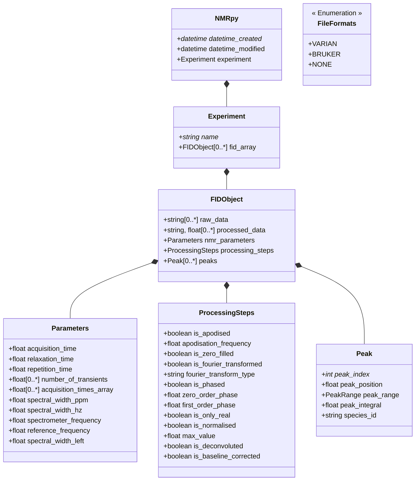

```mermaid
classDiagram
    NMRpy *-- Experiment
    Experiment *-- FIDObject
    FIDObject *-- Parameters
    FIDObject *-- ProcessingSteps
    FIDObject *-- Peak
    
    class NMRpy {
        +datetime datetime_created*
        +datetime datetime_modified
        +Experiment experiment
    }
    
    class Experiment {
        +string name*
        +FIDObject[0..*] fid_array
    }
    
    class FIDObject {
        +string[0..*] raw_data
        +string, float[0..*] processed_data
        +Parameters nmr_parameters
        +ProcessingSteps processing_steps
        +Peak[0..*] peaks
    }
    
    class Parameters {
        +float acquisition_time
        +float relaxation_time
        +float repetition_time
        +float[0..*] number_of_transients
        +float[0..*] acquisition_times_array
        +float spectral_width_ppm
        +float spectral_width_hz
        +float spectrometer_frequency
        +float reference_frequency
        +float spectral_width_left
    }
    
    class ProcessingSteps {
        +boolean is_apodised
        +float apodisation_frequency
        +boolean is_zero_filled
        +boolean is_fourier_transformed
        +string fourier_transform_type
        +boolean is_phased
        +float zero_order_phase
        +float first_order_phase
        +boolean is_only_real
        +boolean is_normalised
        +float max_value
        +boolean is_deconvoluted
        +boolean is_baseline_corrected
    }
    
    class Peak {
        +int peak_index*
        +float peak_position
        +PeakRange peak_range
        +float peak_integral
        +string species_id
    }
    
    class FileFormats {
        << Enumeration >>
        +VARIAN
        +BRUKER
        +NONE
    }
    
```