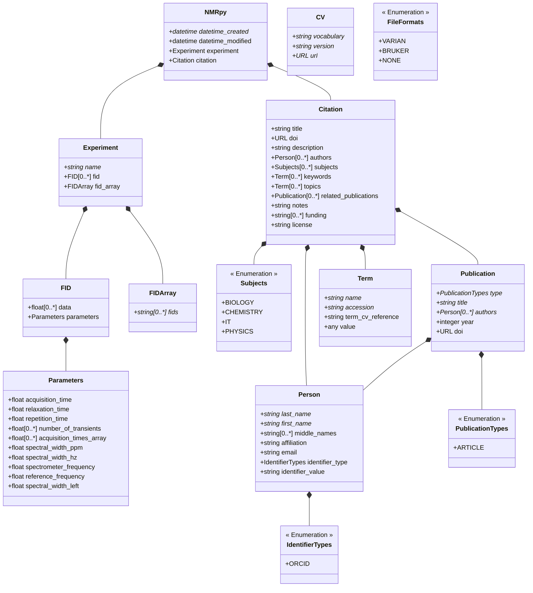

```mermaid
classDiagram
    NMRpy *-- Experiment
    NMRpy *-- Citation
    Experiment *-- FID
    Experiment *-- FIDArray
    FID *-- Parameters
    Citation *-- Subjects
    Citation *-- Person
    Citation *-- Publication
    Citation *-- Term
    Person *-- IdentifierTypes
    Publication *-- PublicationTypes
    Publication *-- Person
    
    class NMRpy {
        +datetime datetime_created*
        +datetime datetime_modified
        +Experiment experiment
        +Citation citation
    }
    
    class Experiment {
        +string name*
        +FID[0..*] fid
        +FIDArray fid_array
    }
    
    class FID {
        +float[0..*] data
        +Parameters parameters
    }
    
    class Parameters {
        +float acquisition_time
        +float relaxation_time
        +float repetition_time
        +float[0..*] number_of_transients
        +float[0..*] acquisition_times_array
        +float spectral_width_ppm
        +float spectral_width_hz
        +float spectrometer_frequency
        +float reference_frequency
        +float spectral_width_left
    }
    
    class FIDArray {
        +string[0..*] fids*
    }
    
    class Citation {
        +string title
        +URL doi
        +string description
        +Person[0..*] authors
        +Subjects[0..*] subjects
        +Term[0..*] keywords
        +Term[0..*] topics
        +Publication[0..*] related_publications
        +string notes
        +string[0..*] funding
        +string license
    }
    
    class Person {
        +string last_name*
        +string first_name*
        +string[0..*] middle_names
        +string affiliation
        +string email
        +IdentifierTypes identifier_type
        +string identifier_value
    }
    
    class Publication {
        +PublicationTypes type*
        +string title*
        +Person[0..*] authors*
        +integer year
        +URL doi
    }
    
    class CV {
        +string vocabulary*
        +string version*
        +URL url*
    }
    
    class Term {
        +string name*
        +string accession*
        +string term_cv_reference
        +any value
    }
    
    class FileFormats {
        << Enumeration >>
        +VARIAN
        +BRUKER
        +NONE
    }
    
    class Subjects {
        << Enumeration >>
        +BIOLOGY
        +CHEMISTRY
        +IT
        +PHYSICS
    }
    
    class PublicationTypes {
        << Enumeration >>
        +ARTICLE
    }
    
    class IdentifierTypes {
        << Enumeration >>
        +ORCID
    }
    
```