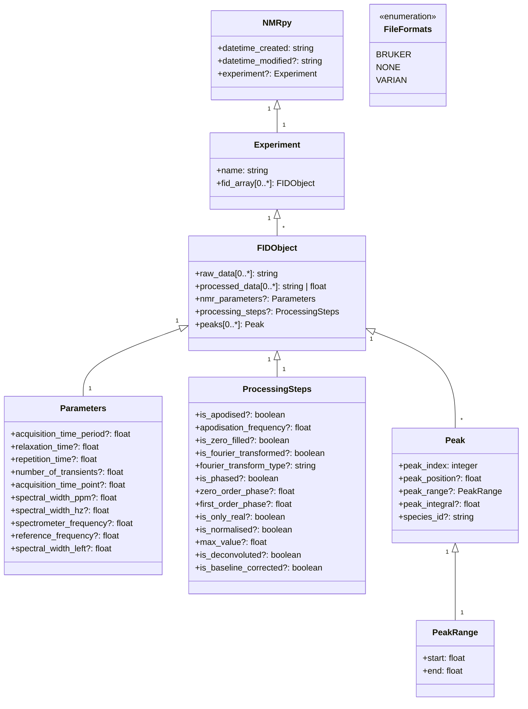

```mermaid
classDiagram
    %% Class definitions with attributes
    class NMRpy {
        +datetime_created: string
        +datetime_modified?: string
        +experiment?: Experiment
    }

    class Experiment {
        +name: string
        +fid_array[0..*]: FIDObject
    }

    class FIDObject {
        +raw_data[0..*]: string
        +processed_data[0..*]: string | float
        +nmr_parameters?: Parameters
        +processing_steps?: ProcessingSteps
        +peaks[0..*]: Peak
    }

    class Parameters {
        +acquisition_time_period?: float
        +relaxation_time?: float
        +repetition_time?: float
        +number_of_transients?: float
        +acquisition_time_point?: float
        +spectral_width_ppm?: float
        +spectral_width_hz?: float
        +spectrometer_frequency?: float
        +reference_frequency?: float
        +spectral_width_left?: float
    }

    class ProcessingSteps {
        +is_apodised?: boolean
        +apodisation_frequency?: float
        +is_zero_filled?: boolean
        +is_fourier_transformed?: boolean
        +fourier_transform_type?: string
        +is_phased?: boolean
        +zero_order_phase?: float
        +first_order_phase?: float
        +is_only_real?: boolean
        +is_normalised?: boolean
        +max_value?: float
        +is_deconvoluted?: boolean
        +is_baseline_corrected?: boolean
    }

    class Peak {
        +peak_index: integer
        +peak_position?: float
        +peak_range?: PeakRange
        +peak_integral?: float
        +species_id?: string
    }

    class PeakRange {
        +start: float
        +end: float
    }

    %% Enum definitions
    class FileFormats {
        <<enumeration>>
        BRUKER
        NONE
        VARIAN
    }

    %% Relationships
    NMRpy "1" <|-- "1" Experiment
    Experiment "1" <|-- "*" FIDObject
    FIDObject "1" <|-- "1" Parameters
    FIDObject "1" <|-- "1" ProcessingSteps
    FIDObject "1" <|-- "*" Peak
    Peak "1" <|-- "1" PeakRange
```